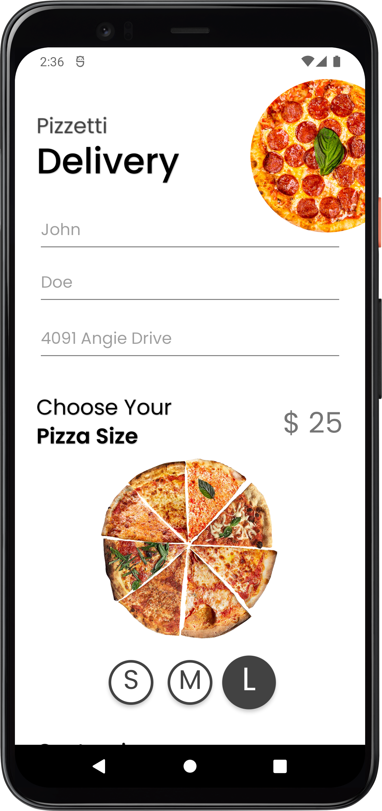
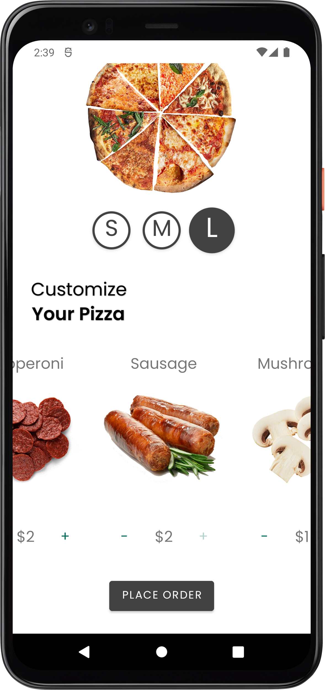

## Pizzetti

## Description
Pizzetti is an android app that allows you to make your custom pizza, look up the price and send a message automatically to your preferred pizza place.

## Screenshots

  
   
 

# Getting started

### Script 
1. Download this repository extract and open the folder
2. Run `newproject.sh` script to create a copy with the name you want 
    * Example: `./newproject.sh -p com.example.project -t Project` 
3. On `app/build.gradle`, update the dependencies Android Studio suggests
4. On `theme.xml` & `colors.xml` set your application primary and secondary colors 

And you're ready to start working on your new app.

### Manual
1. Download this repository extract and open the template folder on Android Studio
2. Rename the app package `io.bloco.template`
3. Check if the manifest package was renamed along with the package
4. On `app/build.gradle`, change the applicationId to the new app package
5. On `app/build.gradle`, update the dependencies Android Studio suggests
6. On `string.xml`, set your application name
7. On `theme.xml` & `colors.xml` set your application primary and secondary colors 

And you're ready to start working on your new app.

# Notes
- Jetifier is enabled inside `gradle.properties`. Even though it's not necessary for the 
  current dependencies, it was left enabled so anyone can start using the template without 
  worrying when to turn it on. We do recommend you to check [Can I drop Jetifier?](https://github.com/plnice/can-i-drop-jetifier) 
  when expanding the template.
- Android Template contains `.github/workflows` for lint check and unit testing. You can easily take this project worflow and repurpose it with a few path changes, you can also find a commented example in test.yml for Instrumentation Testing and CodeCoverage that we advice to keep a clean project, you will however need to replace the secret keys with your own.
